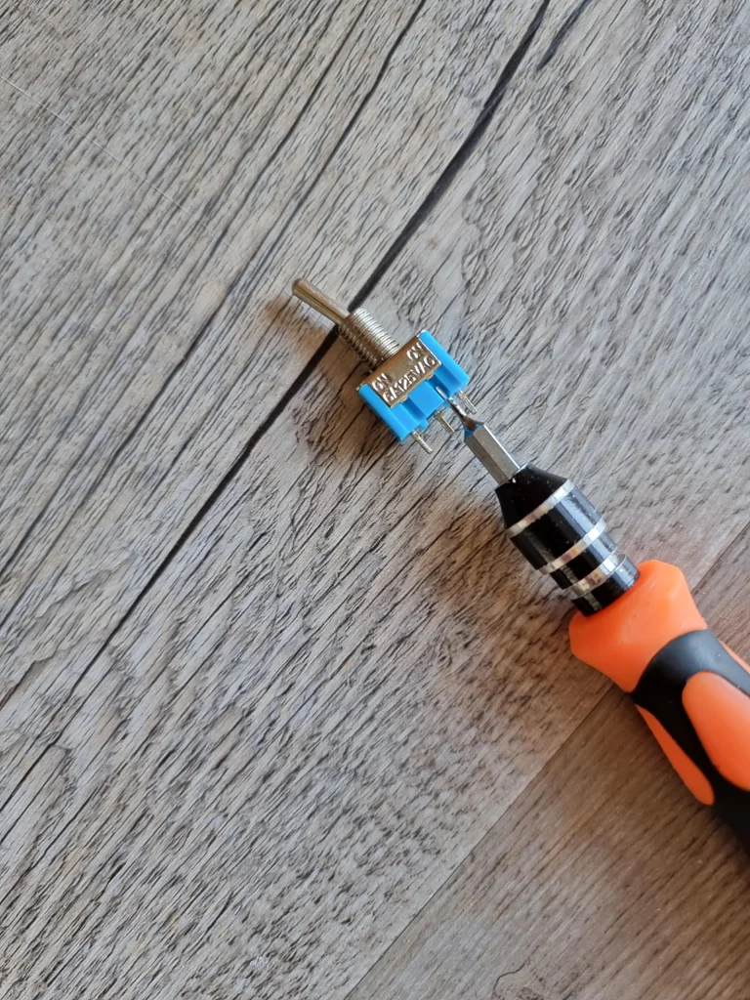
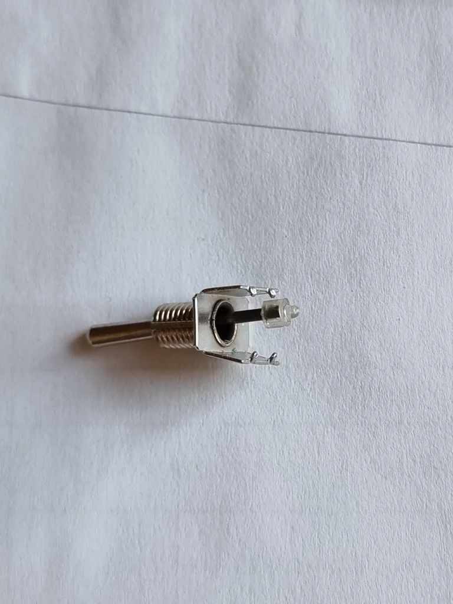
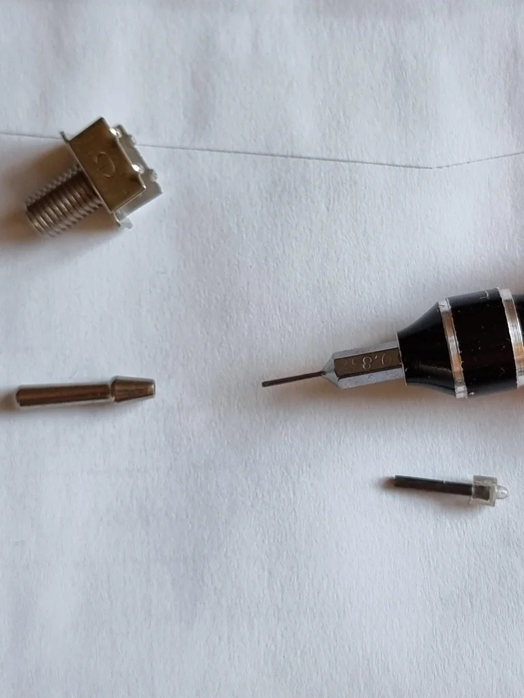
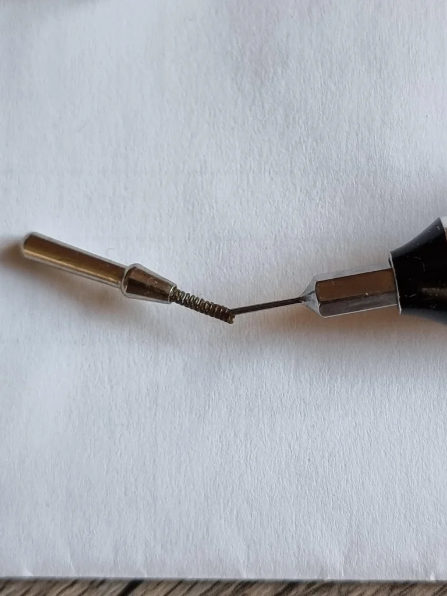
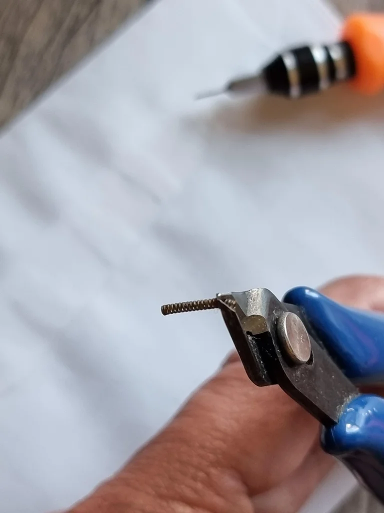
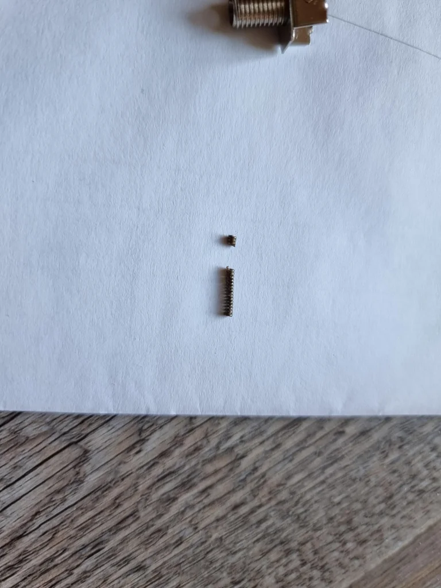

## Reduce Switch Force (New switches)

Some of these toggle switches need a little too much force for our servos to move them. Should that be the case, just remove a few windings of the spring inside the toggle switch. For that, first open the switch case. Remove all the parts inside. If the spring does not fall out you can take a needle and pull it out. I removed 3-4 windings. Better not overdo it at first. Just remove 3-4 windings and check if it helped. Removing too many will lead to the spring not being strong enough anymore so that it will not move the inner metal plate anymore thus making it useless

<!-- align="right" -->
